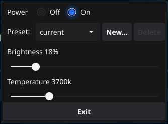

# Go utility for Litra Glow and Beam

## Introduction

After purchasing a [Logitech Litra Glow](https://www.logitech.com/en-us/products/lighting/litra-glow.946-000001.html) I was unable to find any support for linux. [I created a python project](https://github.com/kharyam/litra-driver) which reverse-engineered the basic functionality of the litra glow so that we can control it via USB without using the physical buttons on the device. It also now supports the [Logitech Litra Beam](https://www.logitech.com/en-us/products/lighting/litra-beam.946-000006.html). This project is the port from python to go.


## Quick Start

### Linux
```bash
# If necessary, create a udev role to grant permission to access the light
sudo tee /etc/udev/rules.d/82-litra-glow.rules <<< 'SUBSYSTEM=="usb", ATTR{idVendor}=="046d", ATTR{idProduct}=="c900",MODE="0666"'
sudo tee /etc/udev/rules.d/82-litra-beam.rules <<< 'SUBSYSTEM=="usb", ATTR{idVendor}=="046d", ATTR{idProduct}=="c901",MODE="0666"'

# For most operating systems, reloading udev rules is enough
sudo udevadm control --reload-rules
sudo udevadm trigger

# For others, a reboot may be required
# sudo reboot

# Command Line Interface
lcli --help

# User Interface
lcui

```

## The UI
A basic UI can be launched to allow control of the light:

```bash
lcui
```



## The CLI

```bash
This command line interface allows you to control a litra Glow or Beam 
device using the commands described below.

Usage:
  cli [command]

Available Commands:
  bright      Sets the brightness level (0-100)
  completion  Generate the autocompletion script for the specified shell
  help        Help about any command
  off         Turn lights off
  on          Turn lights on
  temp        Sets the temperature of the lights (2700 - 6500)

Flags:
  -h, --help     help for cli
  -t, --toggle   Help message for toggle

Use "cli [command] --help" for more information about a command.
```

Sample Usage
```bash
lcli on
lcli bright 10
lcli temp 6500
lcli off
```

## Development

### Cobra Config

```bash

cd cli

# Workaround when using workspaces
GOWORK=off cobra-cli init .

# Create skeleton code for each command
cobra-cli add on
cobra-cli add off
cobra-cli add bright
cobra-cli add temp
```
